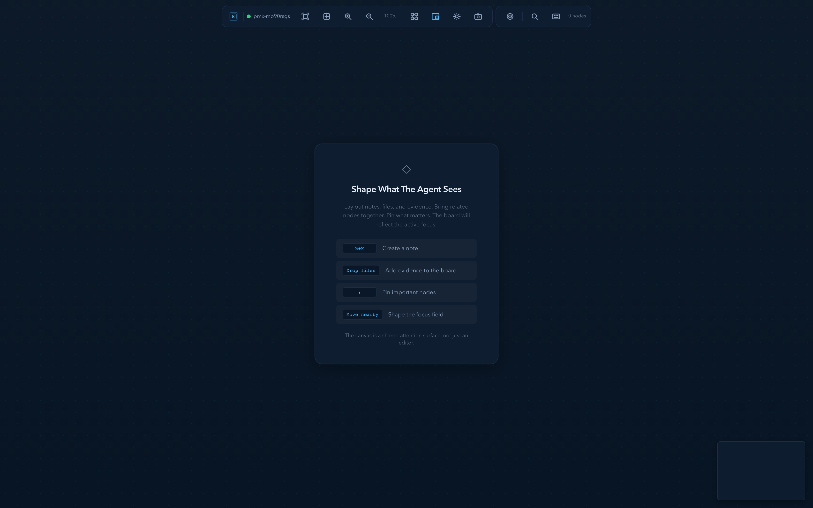
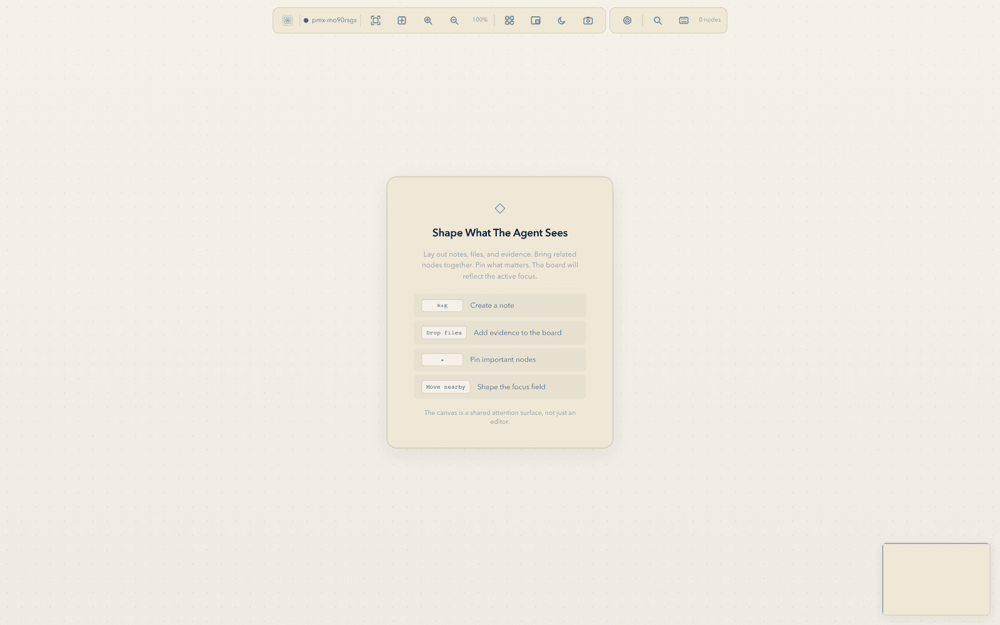
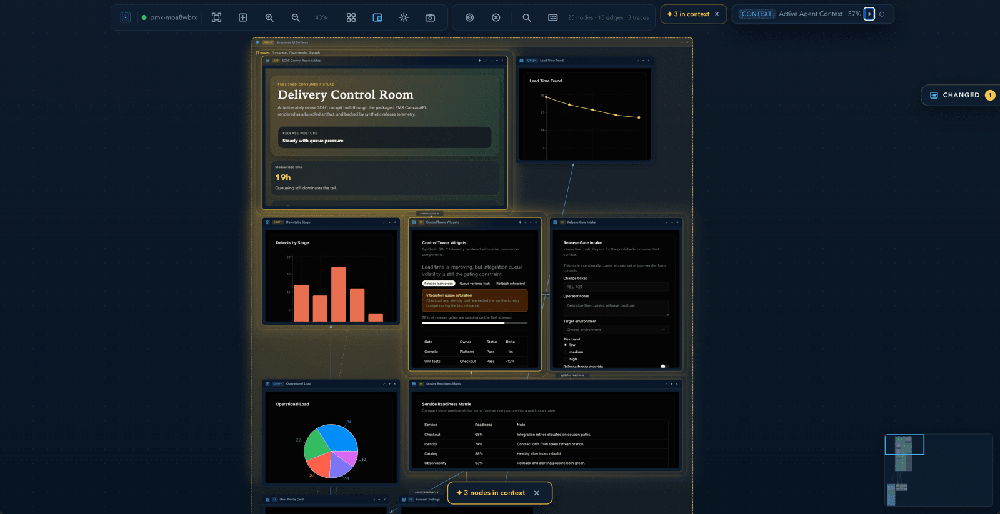
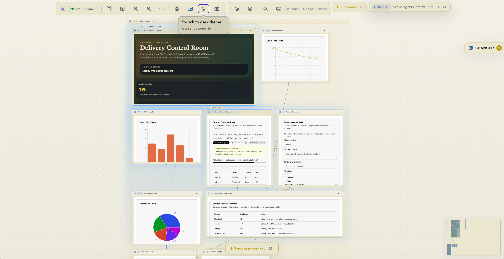

# pmx-canvas

**A shared thinking surface for humans and coding agents.** Drop files, plans,
status, charts, fetched web pages, and hand-drawn diagrams onto the same
infinite 2D canvas; pin what matters; let the agent read your spatial curation
as structured context. Drive it from a CLI, the Model Context Protocol, an
HTTP API, or a Bun-based TypeScript SDK — whichever fits how your agent runs.

<p align="center">
  
  
</p>

<p align="center">
  
  
</p>

PMX Canvas is a **collaborative spatial workspace** that humans and agents share in real time. It works in both directions:

- **Human-first.** You open the canvas, drop in files, sketch a plan, group what belongs together, pin what matters. The agent watches the curation update live and uses it to ground its next action — no prompt engineering, no copy-paste.
- **Agent-first.** You ask the agent to gather data from sources (logs, files, search results, dashboards, web pages), and it lays the findings out as nodes and edges. You step in, rearrange, edit, prune, and steer where the analysis goes next.

### What it's for

pmx-canvas drives any work that benefits from making **context, relations, and provenance explicit**. The canvas turns work that is normally scattered across chat history, tabs, files, and dashboards into something with explicit context (pinned nodes), explicit relations (edges, groups, proximity), and explicit provenance (which side added which piece). Whatever data either the human or the agent pulls in — files, fetched web pages, screenshots, log excerpts, structured panels, charts, hand-drawn diagrams, bundled web artifacts — lives on the same surface and is reachable from both sides.

**The canvas is agnostic about what you do with it.** The reach of the workspace is the union of pmx-canvas's own node types and **whatever your agent's harness already has access to** — MCP servers, MCP apps, shell commands and CLIs, files in the working directory, web-fetch tools, anything else its toolbelt exposes. The canvas itself doesn't care where the data came from; it just needs the agent (or you) to drop it on the surface as the right node type. To make that concrete:

- A **Jira MCP** turns the canvas into a triage board — tickets land as `markdown` nodes you can group by status and pin the in-flight ones.
- A **database MCP** turns it into an exploratory query workbench — each query result becomes a `json-render` table or `graph` node next to the `markdown` node holding the SQL.
- An **Excalidraw MCP app** turns it into a sketch surface — diagrams open as `mcp-app` nodes you can resize and annotate.
- A **shell-driven agent** with `gh` + `kubectl` in its harness turns it into an ops board — open issues become markdown, pod statuses become `status` nodes, the relationships you care about become edges.
- **Plain file reads** in the agent's working directory turn it into a code-context map — `file` nodes for source, `markdown` nodes for the agent's notes, all live-watched.
- A **custom MCP or CLI** for your data source turns it into whatever shape that data fits — without pmx-canvas knowing anything about your domain.

Common use cases — non-exhaustive, mix and match as the work shifts:

- **Idea generation** — capture divergent thoughts spatially without losing them
- **Validation** — test a claim against supporting and refuting evidence
- **Research** — gather, organize, and compare sources from anywhere
- **Analysis** — make sense of accumulated material, surface patterns
- **Mind mapping** — relationships, hierarchies, and structure spatially

…plus anything else the combination of the canvas and your agent's toolbelt — MCP servers, MCP apps, CLIs, file access, web fetch — makes possible.

**Spatial arrangement is communication.** When a human drags three file nodes next to a bug report, the agent knows they're related. When the agent drops 12 webpage nodes from a research session, the human can immediately group, prune, and pin the ones worth keeping. The agent reads spatial state via `canvas://pinned-context`, `canvas://spatial-context`, and the SSE event stream; the human reads the same state through the rendered browser.

## Prerequisites

- [Bun](https://bun.sh) >= 1.3.12

The published SDK entrypoint is Bun-first: `import { createCanvas } from 'pmx-canvas'` is supported in Bun, while Node.js consumers should use the CLI, MCP server, or HTTP API instead.

## Scope

- **Single-machine, today.** One canvas runs per `bunx pmx-canvas` instance, on
  one machine. There is no built-in multi-user auth or presence — collaboration
  means human↔agent on the same machine, plus any other browser tab/agent
  pointed at the same `localhost:4313`. To share a canvas across machines, commit
  `.pmx-canvas/state.json` to your repo and pull it on the other side.
- **What leaves your machine.** The core canvas runs entirely on `localhost`.
  Network egress only happens for explicit, opt-in flows: `webpage` nodes
  fetch the URL you give them; `mcp-app` / `canvas_add_diagram` calls go to
  whatever MCP server URL you configure (the Excalidraw preset uses
  `https://mcp.excalidraw.com/mcp`); `bunx` itself reads the npm registry on
  first install. Nothing else phones home.
- **State auto-saves** to `.pmx-canvas/state.json` (debounced ~500 ms after each
  mutation). Closing the browser tab keeps everything — only `Ctrl-C` (or
  `pmx-canvas serve stop`) on the server actually stops the canvas. Pins,
  positions, and node content survive both. Snapshots live under
  `.pmx-canvas/snapshots/`.

## Quick start

There are two paths into pmx-canvas, and they work together. Pick whichever
matches who is starting the session — you can hand off to the other side at any
point because both halves drive the same canvas.

### Easiest: install the `pmx-canvas` agent skill (recommended)

The fastest way to get going is to install the main `pmx-canvas` agent skill
into your agent of choice. The skill teaches the agent how to install the
package, start the server, and drive every node type, group, snapshot, and
search the canvas exposes. You don't have to install the rest of the bundled
skills (`web-artifacts-builder`, `pmx-canvas-testing`, `playwright-cli`, the
`json-render-*` family, etc.) — once the canvas is running, the agent can read
`canvas://skills` and pull in companion skills as the work demands.

Three install paths, in order of how universal they are:

```bash
# 1. GitHub CLI extension. `gh skill` is the official Agent Skills extension
#    for the GitHub CLI — it knows where each harness keeps its skills tree
#    and copies the SKILL.md and assets into the right place. Requires
#    `gh` >= 2.90. See https://cli.github.com/manual/gh_skill_install.
gh skill install pskoett/pmx-canvas pmx-canvas

# 2. Agent Skills CLI. `npx skills` is the runtime-agnostic installer for
#    skills that follow the Agent Skills specification
#    (https://agentskills.io/specification). It works for any agent harness
#    that reads from a per-user or per-project skills directory.
npx skills add pskoett/pmx-canvas/skills/pmx-canvas

# 3. Manual clone + copy. Works everywhere; you pick where the skill lands.
git clone https://github.com/pskoett/pmx-canvas.git
cp -r pmx-canvas/skills/pmx-canvas <your-agent-skills-dir>
```

For path 3, point at whichever directory your agent harness reads. Common
defaults — check your harness docs if it isn't here:

| Harness | Skills directory |
|---------|------------------|
| Claude Code | `.claude/skills/` (project) or `~/.claude/skills/` (user-wide) |
| GitHub Copilot CLI | `.github/skills/`, `.claude/skills/`, or `.agents/skills/` (project); `~/.copilot/skills/`, `~/.claude/skills/`, or `~/.agents/skills/` (user-wide). [docs](https://docs.github.com/en/copilot/how-tos/copilot-cli/customize-copilot/add-skills) |
| Cross-harness convention | `.agents/skills/` (project) — followed by an increasing number of harnesses, see the [Agent Skills specification](https://agentskills.io/specification) |
| Other / unsure | check your harness's docs for the canonical skills directory |

After install, point your agent at the skill and try the **minimum-viable
prompt**:

> *"Use the `pmx-canvas` skill to start the canvas, then add this repo's
> `Readme.md` and the top three source files as `file` nodes. Auto-arrange
> them and pin two."*

You should see the browser open and four nodes appear inside ~10 seconds. If
that works, the skill, the canvas, and the agent are all wired up.

If your agent isn't MCP-capable yet, wire it up first — see
[Connect your agent (MCP)](#connect-your-agent-mcp) for the JSON snippet that
turns `bunx pmx-canvas --mcp` into a stdio MCP server your harness can connect
to. The skill assumes the agent can call MCP tools. From there
work up to richer prompts — the [Example](#example-pull-data-in-build-something-out)
section below has a fuller flow.

For a richer install (the full bundle as a plugin marketplace, mirroring the
pattern in [`pskoett-ai-skills`](https://github.com/pskoett/pskoett-ai-skills)),
see [Agent skills](#agent-skills) below.

### Run it directly (no agent required)

You don't need an agent to use pmx-canvas — the workbench, CLI, and HTTP API
are first-class on their own.

#### Install from npm

```bash
bunx pmx-canvas              # Start canvas, open browser
bunx pmx-canvas --demo       # Start with sample nodes
bunx pmx-canvas --no-open    # Headless (good for daemons / CI)
bunx pmx-canvas --mcp        # Run as MCP server (stdio)
bunx pmx-canvas --help       # All commands
bunx pmx-canvas serve --daemon --no-open --wait-ms=20000  # Detached background mode
```

The canvas opens at `http://localhost:4313`. Try `bunx pmx-canvas --demo`
first — you'll see three nodes connected by two edges; that confirms the
canvas server, the browser bundle, and the SSE event stream are all wired up.

#### Install from source

```bash
git clone https://github.com/pskoett/pmx-canvas.git
cd pmx-canvas
bun install
bun run build
bun run dev                   # Start + open browser
bun run dev:demo              # Start with sample nodes
```

For a stable local hostname, install [Portless](https://github.com/vercel-labs/portless)
first **and then** run the portless variant:

```bash
npm install -g portless
bun run dev:portless          # https://pmx.localhost/workbench
```

The published `bunx pmx-canvas` path defaults to plain loopback and does **not**
depend on Portless.

#### Test the unpublished CLI from a repo checkout

If you want to exercise the real package before publishing, link the repo locally:

```bash
git clone https://github.com/pskoett/pmx-canvas.git
cd pmx-canvas
bun install
bun run build
bun link

# Then from any shell:
pmx-canvas --help
pmx-canvas --no-open
```

For one-off local runs without linking, `bun run src/cli/index.ts ...` works too.

### Recommended ways to drive the canvas

Once the canvas is up, pick the control surface that fits your agent or script:

- **CLI** for local use, scripting, automation, and terminal-native agents.
- **MCP** for agents that already speak the Model Context Protocol — 38 tools +
  8 core resources, including the bundled-skill index at `canvas://skills`.
- **HTTP API** for REST/SSE clients in any language.
- **Bun SDK** for TypeScript code running on Bun.

The CLI and MCP cover normal canvas work; the reference sections below show
the exact commands, tools, and payloads.

#### Connect your agent (MCP)

Add to your agent's MCP config:

```json
{
  "mcpServers": {
    "canvas": {
      "command": "bunx",
      "args": ["pmx-canvas", "--mcp"]
    }
  }
}
```

The canvas auto-starts on first tool call. Works with any MCP-capable agent
harness — pmx-canvas does not depend on a specific coding agent.

For developer flows on the `pmx-canvas` repo itself (release process,
contribution gates, etc.) see [`AGENTS.md`](AGENTS.md) and
[`docs/RELEASE.md`](docs/RELEASE.md).

## Example: pull data in, build something out

The canvas is most useful when it's *not* empty. The pattern is the same
across every use case: gather data from whatever surfaces the human or the
agent has access to, lay it out using whichever node types fit, then
collaborate on the result.

A research / analysis example against a release-planning workflow:

> *"Read the latest release notes from `CHANGELOG.md`, the open issues from
> our GitHub repo, last week's deploy logs, and the pricing page from
> example.com. Put each one on the canvas as the right node type — markdown
> for the changelog, file nodes for the local files, status nodes for the
> deploy events, a webpage node for the URL — then build me a json-render
> dashboard and a chart that summarize what shipped, what broke, and what's
> still open."*

The same shape works for any use case. *Idea generation:* "give me twelve
angles on X, drop each as a markdown node, arrange in a flow layout."
*Validation:* "for the claim in the pinned node, place supporting and
refuting sources beside it as webpage and file nodes." *Mind mapping:*
"build a tree of the concepts in [topic] — central concept top-center,
major branches as groups, sub-concepts inside each group connected with
depends-on edges."

[`skills/pmx-canvas/SKILL.md`](skills/pmx-canvas/SKILL.md) has step-by-step
recipes for these and other patterns under *Workflow Patterns*. New
patterns become viable whenever you add an MCP server or MCP app — the
canvas surface stays the same, the things you can put on it grow.

What the agent does, end to end:

1. Reads each source via the tools your harness already provides (filesystem,
   web fetch, GitHub API, log readers — pmx-canvas does not impose data
   sources; bring your own).
2. Calls the canvas to drop each finding on the workbench:
   - `markdown` for narrative notes and AI-summarized text
   - `file` for live-watching local source files
   - `webpage` for fetched web pages with cached extracted text
   - `image` for screenshots and exported diagrams
   - `status` / `ledger` / `trace` for structured runtime/evaluation state
   - `json-render` for inline structured UI (dashboards, tables, forms) — see
     [Json-render nodes](#json-render-nodes)
   - `graph` for line / bar / pie / radar / stacked / composed charts — see
     [the schema reference](#schema-driven-discovery)
   - `mcp-app` (Excalidraw and other MCP App servers) for hand-drawn diagrams
   - `web-artifact` for full bundled React/Tailwind interactive surfaces — see
     [Web artifacts](#web-artifacts)
   - `group` to bound related nodes into a frame
   - `edge` to connect findings (`flow`, `depends-on`, `relation`,
     `references`) so the relationships are first-class, not implicit
3. You step into the canvas, rearrange, prune, group, and **pin** the nodes
   that matter.
4. The agent reads `canvas://pinned-context` and `canvas://spatial-context`
   and uses your curation to ground the next round of analysis or build.

This loop works for investigations, architecture sketches, research surveys,
release planning, dashboards, post-mortems, lecture notes — anywhere the gap
between "I have the data somewhere" and "I have a coherent picture" is
currently blocking your thinking.

## How it works

The same simple loop runs in both directions, regardless of what the work
actually is:

1. **Either side adds material** to the canvas. The agent uses any tool its
   harness exposes (file reads, web fetch, an attached MCP server, an MCP
   app, the canvas's own tools) and lays the result out as the right node
   type. The human drops files, drags nodes around, types markdown.
2. **The human curates spatial structure** — they group, position, draw
   edges, and pin what matters. Curation is communication: proximity means
   relatedness, pinning means "agent, focus here."
3. **The agent reads that structure as machine-readable context.**
   `canvas://pinned-context` returns the pinned nodes plus their nearby
   neighbors. `canvas://spatial-context` returns proximity clusters,
   reading order, and pinned neighborhoods. SSE notifies the agent the
   moment any of it changes.
4. **The agent acts on that context** using whatever tools are at its
   disposal — `bunx pmx-canvas`'s 38 MCP tools, plus every other MCP your
   harness has connected. Each new MCP expands what the loop can do without
   changing the loop.

The canvas's job is to keep that loop honest: spatial state stays explicit,
provenance stays attributable to the side that made it, and both sides see
the same workspace via different surfaces.

## Features

### Canvas

- Infinite 2D canvas with pan, zoom, and scroll
- Minimap with click-to-navigate
- Auto-arrange layouts (grid, column, flow)
- Multi-select with selection bar actions
- Snap-to-alignment guides while dragging nodes
- Keyboard shortcuts (Cmd+0 reset, Cmd+/- zoom, Tab cycle, Esc deselect)
- Command palette (Cmd+K) -- search nodes and actions
- In-UI shortcut overlay -- press `?` for the full cheatsheet
- Context menu on right-click
- Docked panels -- pin nodes to left/right HUD
- Expanded view -- click to expand any node to full-screen overlay
- Inline markdown editor with format bar for rich in-place editing
- Attention toasts + history -- surface agent mutations the human didn't initiate
- Layout validation -- detect collisions, containment breaches, and missing edge endpoints
- Themes: dark (default), light, high-contrast
- Persistence: auto-saves to `.pmx-canvas/state.json`, restores on restart

### Node types

| Type | Description |
|------|-------------|
| `markdown` | Rich markdown with rendered preview |
| `status` | Compact status indicator (phase, message, elapsed time) |
| `context` | Context cards, token usage, workspace grounding |
| `ledger` | Execution ledger summary |
| `trace` | Agent trace pills (tool calls, subagent activity) |
| `file` | Live file viewer with auto-update on disk changes |
| `image` | Image viewer (file paths, data URIs, URLs) |
| `webpage` | Persisted webpage snapshot with stored URL, extracted text, and refresh support |
| `mcp-app` | Tool-backed hosted MCP app iframes (Excalidraw, web artifacts, etc.) -- see [MCP app nodes](#mcp-app-nodes) |
| `json-render` | Structured UI from JSON specs |
| `graph` | Line, bar, pie, area, scatter, radar, stacked-bar, and composed charts |
| `group` | Spatial container/frame that contains other nodes |

Thread node types `prompt` and `response` are used internally for agent conversation
rendering and are not created directly through the public APIs.

### Edge types

All edges support labels, styles (solid/dashed/dotted), and animation.

| Type | Use case |
|------|----------|
| `flow` | Sequential steps, data flow |
| `depends-on` | Dependencies between tasks |
| `relation` | General relationships |
| `references` | Cross-references, evidence links |

### File nodes

File nodes display project files with line numbers and language detection. When an agent edits a file through its normal tools, the canvas node updates automatically via `fs.watch()`.

```typescript
canvas_add_node({ type: 'file', content: 'src/server/index.ts' })
```

### Image nodes

Image nodes display local paths, remote URLs, and data URIs. File-backed and
HTTP(S)-backed images preserve provenance so agents can tell where evidence
came from, and nodes can carry validation status or warnings when an agent is
using screenshots as proof.

```typescript
canvas_add_node({
  type: 'image',
  content: 'artifacts/dashboard.png',
  data: {
    validationStatus: 'passed',
    validationMessage: 'Screenshot matches the requested dashboard state.',
  },
})
```

### Webpage nodes

Webpage nodes store the source URL on the node, fetch the page server-side, and cache extracted text for search, pins, and agent context. Saved canvases keep enough information for an agent to come back later and refresh the node from the original URL.

```typescript
canvas_add_node({ type: 'webpage', url: 'https://example.com/docs' }) // content still works, but url is canonical
canvas_refresh_webpage_node({ id: 'node-abc123' })
```

### MCP app nodes

`mcp-app` nodes embed other MCP servers' UI resources (`ui://...`) directly on the canvas as
sandboxed iframes. Any server that implements the [MCP Apps extension](https://modelcontextprotocol.io/docs/extensions/apps)
can be opened as a node with `canvas_open_mcp_app`.

Generic `pmx-canvas node add --type mcp-app` is intentionally rejected because these nodes need
tool/session metadata. Use `pmx-canvas web-artifact build` for bundled React artifacts or
`pmx-canvas external-app add --kind excalidraw` for the Excalidraw preset.

#### Recommended: Excalidraw (hand-drawn diagrams)

[Excalidraw](https://github.com/excalidraw/excalidraw-mcp) ships a hosted MCP server at
`https://mcp.excalidraw.com/mcp` that renders hand-drawn diagrams with streaming draw-on
animations and fullscreen editing. It is a strong example of an MCP App that fits naturally
inside PMX Canvas: the app opens as a node, can be moved and pinned like any other node, and
supports fullscreen editing when you want to expand it into a larger workspace.

PMX Canvas ships a preset so an agent can open an Excalidraw diagram in one call, without wiring
the transport by hand:

```bash
pmx-canvas external-app add --kind excalidraw --title "Agent to Canvas"
```

```typescript
canvas_add_diagram({
  elements: [
    { type: 'rectangle', id: 'a', x: 80, y: 120, width: 180, height: 80,
      roundness: { type: 3 }, backgroundColor: '#a5d8ff', fillStyle: 'solid',
      label: { text: 'Agent', fontSize: 18 } },
    { type: 'rectangle', id: 'b', x: 380, y: 120, width: 180, height: 80,
      roundness: { type: 3 }, backgroundColor: '#d0bfff', fillStyle: 'solid',
      label: { text: 'PMX Canvas', fontSize: 18 } },
    { type: 'arrow', id: 'a1', x: 260, y: 160, width: 120, height: 0,
      startBinding: { elementId: 'a' }, endBinding: { elementId: 'b' },
      label: { text: 'adds nodes' } },
  ],
  title: 'Agent → Canvas',
});
```

Under the hood this is just a thin alias for `canvas_open_mcp_app` with the Excalidraw transport
preset. You can use the hosted Excalidraw server directly, or point the same flow at a local
`excalidraw-mcp` instance if you prefer running the app yourself. For any other MCP app, use
`canvas_open_mcp_app` directly:

```typescript
canvas_open_mcp_app({
  transport: { type: 'http', url: 'https://mcp.excalidraw.com/mcp' },
  toolName: 'create_view',
  serverName: 'Excalidraw',
  toolArguments: { elements: '[ ... ]' },
});
```

The canvas runs the tool against the remote MCP server, renders the returned `ui://` resource in
a sandboxed iframe node, and keeps the resource's CSP + permission hints intact. Resize, drag,
and pin the node like any other canvas node. Edits made in expanded/fullscreen mode are persisted
back into the node model context and replayed when the iframe remounts.

### Json-render nodes

`json-render` nodes turn structured JSON specs into rendered UI panels (dashboards, tables, forms,
cards) without writing HTML. PMX Canvas ships the [`@json-render/*`](https://www.npmjs.com/package/@json-render/core)
runtime and component catalog (core + react + shadcn), so agents can describe an interface as a
spec and render it inline on the canvas.

```typescript
canvas_add_json_render_node({
  title: 'Deploy status',
  spec: {
    root: 'card',
    elements: {
      card: { type: 'Card', props: { title: 'Deploy' }, children: ['status'] },
      status: { type: 'Badge', props: { variant: 'default', text: 'Healthy' } },
    },
  },
});
```

`Badge` uses shadcn variants: `default`, `secondary`, `destructive`, and `outline`.
Older saved specs using `label` or status variants such as `success`/`warning` are
normalized during validation for compatibility.

Use `canvas_describe_schema` / `canvas_validate_spec` to introspect the component catalog before
building a spec -- see [Schema-driven discovery](#schema-driven-discovery).

### Web artifacts

A **web artifact** is a single-file, fully bundled HTML app (React + Tailwind + shadcn) that an
agent builds from TSX source and drops onto the canvas as an embedded node. Useful when you want
a real interactive UI -- charts, forms, mini-dashboards -- instead of a static node.

`canvas_build_web_artifact` takes source strings (`App.tsx`, optional `index.css`, `main.tsx`,
`index.html`, plus extra files), runs the bundled web-artifacts-builder scripts, writes the
self-contained HTML to `.pmx-canvas/artifacts/<slug>.html`, and (by default) opens it in the canvas.

```bash
pmx-canvas node add --type web-artifact --title "Dashboard" --app-file ./App.tsx
pmx-canvas web-artifact build --title "Dashboard" --app-file ./App.tsx --deps recharts --include-logs
```

The scaffold includes `recharts` for chart-heavy artifacts. Pass `--deps name,name2` for any
additional package dependencies before bundling. Failed or empty CLI bundles print `ok: false`,
exit non-zero, and do not create a canvas node.

The matching agent skill is at [skills/web-artifacts-builder/SKILL.md](skills/web-artifacts-builder/SKILL.md).

### Groups

Groups are spatial containers that visually contain other nodes. They render as dashed-border frames with a title bar and optional accent color.

- Select 2+ nodes and click "Group" in the selection bar
- Right-click a group to ungroup
- Collapsing a group hides children and shows a summary
- By default, group creation preserves the children's current positions and expands the frame around them
- Pass `childLayout` to auto-pack children (`grid`, `column`, `flow`)
- Pass explicit `x`, `y`, `width`, and `height` to create a manual frame and lay children out inside it

```typescript
canvas_create_group({ title: 'Auth Module', childIds: ['node-1', 'node-2'], color: '#4a9eff' })
```

### Batch operations

Batch mode lets you build a canvas in one shot and reference earlier results from later operations.

- HTTP: `POST /api/canvas/batch`
- CLI: `pmx-canvas batch --file ./canvas-ops.json`
- MCP: `canvas_batch`
- SDK: `await canvas.runBatch([...])`

Supported operations:

- `node.add`
- `node.update`
- `graph.add`
- `edge.add`
- `group.create`
- `group.add`
- `group.remove`
- `pin.set`, `pin.add`, `pin.remove`
- `snapshot.save`
- `arrange`

`node.add` also supports `type: "webpage"` inside batch. The batch itself still succeeds when the
webpage node is created but the fetch fails; the per-operation result includes `fetch: { ok, error? }`
plus a top-level `error` field for the fetch problem.

Example:

```json
{
  "operations": [
    {
      "op": "graph.add",
      "assign": "wins",
      "args": {
        "title": "Major wins",
        "graphType": "bar",
        "data": [
          { "label": "Docs", "value": 5 },
          { "label": "Tests", "value": 8 }
        ],
        "xKey": "label",
        "yKey": "value"
      }
    },
    {
      "op": "group.create",
      "assign": "frame",
      "args": {
        "title": "Quarterly graphs",
        "childIds": ["$wins.id"]
      }
    }
  ]
}
```

### Schema-driven discovery

Agents don't have to guess node shapes. The running server exposes its own create schemas,
json-render component catalog, and node-type examples so an agent can introspect before building.

- `canvas_describe_schema` / `GET /api/canvas/schema` -- list all node-create schemas, required
  fields, json-render components, and sample payloads
- `canvas_validate_spec` / `POST /api/canvas/schema/validate` -- validate a json-render spec or
  graph payload **without** creating a node
- `canvas_validate` / `GET /api/canvas/validate` -- validate the current layout for collisions,
  containment, and missing edge endpoints
- `canvas://schema` -- the same schema data as an MCP resource

The CLI's `node schema` / `validate spec` subcommands surface the same data from the terminal,
which is strictly better than guessing flags or payloads.

MCP node creation uses dedicated tools for structured node families. Read
`mcp.nodeTypeRouting` from `canvas_describe_schema` / `canvas://schema` when in doubt:
`json-render` -> `canvas_add_json_render_node`, `graph` -> `canvas_add_graph_node`,
`web-artifact` -> `canvas_build_web_artifact`, `external-app` -> `canvas_open_mcp_app`,
and `group` -> `canvas_create_group`. Basic nodes such as `markdown`, `status`, `file`,
`image`, and `webpage` use `canvas_add_node`.

### Persistence

Canvas state auto-saves to `.pmx-canvas/state.json` in the workspace root on every mutation (debounced). The file is git-committable -- spatial knowledge persists across sessions and can be shared with a team. Everything the canvas generates (state, snapshots, web artifacts, daemon log/pid) is consolidated under `.pmx-canvas/`. Legacy `.pmx-canvas.json` and `.pmx-canvas-snapshots/` are migrated to the new layout automatically on first boot.

Configuration env vars:

- `PMX_CANVAS_STATE_FILE` -- override the persistence path
- `PMX_WEB_CANVAS_PORT` -- server-side default port (server may fall back to another port if taken)
- `PMX_CANVAS_PORT` -- CLI client-side default target port
- `PMX_CANVAS_THEME` -- default theme (`dark`, `light`, `high-contrast`)
- `PMX_CANVAS_DISABLE_BROWSER_OPEN=1` -- skip auto-opening a browser (useful in CI)

### Snapshots

Named checkpoints of the entire canvas state. Save before a refactor, restore if the approach fails, switch between workstreams.

```typescript
canvas_snapshot({ name: 'before refactor' })
canvas_restore({ id: 'snap-abc123' })
```

Stored in `.pmx-canvas/snapshots/`. Toolbar button opens a panel to save, browse, restore, and delete.

### Spatial semantics

The canvas understands spatial arrangement and exposes it to agents:

- **`canvas://spatial-context`** -- proximity clusters, reading order, pinned neighborhoods
- **`canvas://pinned-context`** -- includes nearby unpinned nodes for each pin (the human's implicit context)
- **`canvas_search`** -- find nodes by title/content keywords

### Time travel

Every mutation is recorded with undo/redo support (last 200 operations):

- **`canvas_undo`** / **`canvas_redo`** -- step through history
- **`canvas://history`** -- readable mutation timeline
- **`canvas_diff`** -- compare current state vs any saved snapshot

### Code graph

File nodes automatically detect import dependencies between each other. Add file nodes and watch `depends-on` edges appear as the system parses `import`/`require`/`from` statements across JS/TS, Python, Go, and Rust.

- **`canvas://code-graph`** -- dependency structure: central files, isolated files, import chains
- Auto-edges update live when files change on disk

### Real-time sync

- SSE push: server broadcasts all changes to connected browsers instantly
- Bidirectional: browser interactions (drag, resize, pin) sync back to server
- Auto-reconnect with exponential backoff
- MCP resource change notifications close the human-to-agent loop

### Semantic watch

`pmx-canvas watch` consumes the SSE stream and emits compact semantic deltas
for agents that need low-token updates instead of full layout snapshots. It
filters noise from harmless moves and reports meaningful events such as pins,
node additions/removals, group changes, edge connections, and moves that
change spatial clustering.

```bash
pmx-canvas watch --events context-pin,move-end
pmx-canvas watch --json --events context-pin --max-events 1
```

### WebView automation

Agents can drive a headless Bun.WebView (Chromium or WebKit) pointed at their own workbench,
so they can screenshot, inspect, and script the live canvas without spawning a user-visible
browser.

- **Why**: let an agent verify its own UI state (what does the canvas actually look like right now?),
  capture screenshots for PR reviews, or script interactions in tests
- **Controls**: `canvas_webview_start` / `_stop` / `_status` to manage the session,
  `canvas_evaluate` to run JS in the page, `canvas_resize` to change viewport,
  `canvas_screenshot` for PNG/JPEG/WebP captures
- **Backends**: WebKit on macOS by default; Chrome/Chromium elsewhere (override with `--backend`)
- **Mirrored surfaces**: CLI (`pmx-canvas webview ...`), HTTP (`/api/workbench/webview/*`),
  SDK (`canvas.startAutomationWebView()` / `evaluateAutomationWebView()` / `screenshotAutomationWebView()`)

```bash
pmx-canvas --webview-automation           # start canvas + headless WebView session
pmx-canvas webview screenshot --output ./canvas.png
```

### Daemon mode

Run the canvas as a detached background process with pid/log tracking instead of holding a
terminal:

```bash
pmx-canvas serve --daemon --no-open       # start detached, wait for health
pmx-canvas serve status                   # inspect health + pid state
pmx-canvas serve stop                     # stop the daemon for this port/pid file
```

## Agent skills

Installing `pmx-canvas` also ships a library of reusable agent skills under the package's
`skills/` directory that teach your agent how to use the canvas and adjacent capabilities
effectively:

| Skill | Purpose |
|-------|---------|
| [`pmx-canvas`](skills/pmx-canvas/SKILL.md) | **Core canvas workflows** — when to create which node type, how to pin for context, batch builds. Start here. |
| [`web-artifacts-builder`](skills/web-artifacts-builder/SKILL.md) | Build single-file React/Tailwind artifacts and drop them on the canvas as embedded nodes |
| [`json-render-core`](skills/json-render-core/SKILL.md) | Drive the `@json-render/core` runtime — the spec format, parsing, and validation |
| [`json-render-react`](skills/json-render-react/SKILL.md) | Render json-render specs into React using the runtime |
| [`json-render-shadcn`](skills/json-render-shadcn/SKILL.md) | The shadcn/ui component catalog — Card, Stack, Button, Form fields, Tables |
| [`json-render-mcp`](skills/json-render-mcp/SKILL.md) | Expose a json-render spec as a `ui://` MCP resource |
| [`json-render-codegen`](skills/json-render-codegen/SKILL.md) | Generate json-render specs from prompts / structured input |
| [`json-render-ink`](skills/json-render-ink/SKILL.md) | Render json-render specs to the terminal via Ink |
| [`pmx-canvas-testing`](skills/pmx-canvas-testing/SKILL.md) | Testing patterns against the running canvas |
| [`playwright-cli`](skills/playwright-cli/SKILL.md) | Browser automation recipes for canvas + arbitrary pages |
| [`frontend-design`](skills/frontend-design/SKILL.md), [`web-design-guidelines`](skills/web-design-guidelines/SKILL.md) | Design-quality rules for agent-generated UI |
| [`doc-coauthoring`](skills/doc-coauthoring/SKILL.md) | Structured doc-writing flow |
| [`data-analysis`](skills/data-analysis/SKILL.md) | Data exploration patterns |

(`published-consumer-e2e` exists in `skills/` for maintainer use — it smoke-tests the
published `bunx` path against a clean temp consumer — but it isn't a user-facing skill.)

You only need to install [`pmx-canvas`](skills/pmx-canvas/SKILL.md) up front (see the
[Quick start](#quick-start)) — once the canvas is running, the agent can read
`canvas://skills` to discover the rest and pull them in as the work demands. The core skill
also references the companion skills directly so the agent knows when each one is the right
tool.

## Integration

### CLI and MCP alignment

CLI and MCP are kept aligned for the main canvas operations: node and edge
creation, graph/json-render nodes, web artifacts, external apps, groups,
batch builds, layout validation, snapshots, search, focus, pins, undo/redo,
semantic watch streams, WebView automation, and daemon/server control where
it applies. A few agent-native capabilities, such as resource subscriptions
and `canvas_diff`, remain MCP-only.

### MCP server

38 tools + 8 core resources, plus per-skill resources under `canvas://skills/<name>`.
Zero config for any MCP-capable agent.

<details>
<summary>MCP tools</summary>

| Tool | Description |
|------|-------------|
| `canvas_add_node` | Add a node (markdown, status, context, file, webpage, etc.) |
| `canvas_add_diagram` | Draw a hand-drawn diagram via the hosted Excalidraw MCP app (preset alias for `canvas_open_mcp_app`) |
| `canvas_open_mcp_app` | Open any [MCP Apps](https://modelcontextprotocol.io/docs/extensions/apps) server's `ui://` resource as an iframe node |
| `canvas_describe_schema` | Describe the running server's create schemas, examples, and json-render catalog |
| `canvas_validate_spec` | Validate a json-render spec or graph payload without creating a node |
| `canvas_refresh_webpage_node` | Re-fetch and update a webpage node from its stored URL |
| `canvas_add_json_render_node` | Create a native json-render node from a validated spec |
| `canvas_add_graph_node` | Create a native graph node (line, bar, pie, area, scatter, radar, stacked-bar, composed) |
| `canvas_build_web_artifact` | Build a bundled HTML artifact and open it on the canvas |
| `canvas_update_node` | Update content, position, size, collapsed state |
| `canvas_remove_node` | Remove a node and its edges |
| `canvas_get_layout` | Get full canvas state |
| `canvas_get_node` | Get a single node by ID |
| `canvas_add_edge` | Connect two nodes |
| `canvas_remove_edge` | Remove a connection |
| `canvas_arrange` | Auto-arrange (grid/column/flow) |
| `canvas_validate` | Validate collisions, containment, and missing edge endpoints |
| `canvas_focus_node` | Pan viewport to a node; use CLI `focus --no-pan` when you only need to select/raise |
| `canvas_pin_nodes` | Pin nodes to include in agent context |
| `canvas_clear` | Clear all nodes and edges |
| `canvas_snapshot` | Save current canvas as a named snapshot |
| `canvas_list_snapshots` | List saved snapshots |
| `canvas_restore` | Restore canvas from a saved snapshot |
| `canvas_delete_snapshot` | Delete a saved snapshot |
| `canvas_search` | Find nodes by title/content keywords |
| `canvas_undo` | Undo the last canvas mutation |
| `canvas_redo` | Redo the last undone mutation |
| `canvas_diff` | Compare current canvas vs a saved snapshot |
| `canvas_create_group` | Create a group containing specified nodes |
| `canvas_group_nodes` | Add nodes to an existing group |
| `canvas_ungroup` | Release all children from a group |
| `canvas_batch` | Run a batch of canvas operations with `$ref` support |
| `canvas_webview_status` | Get Bun.WebView automation status for the workbench |
| `canvas_webview_start` | Start or replace the Bun.WebView automation session |
| `canvas_webview_stop` | Stop the active Bun.WebView automation session |
| `canvas_evaluate` | Evaluate JavaScript in the active workbench automation session |
| `canvas_resize` | Resize the active workbench automation viewport |
| `canvas_screenshot` | Capture a screenshot from the active workbench automation session |

</details>

<details>
<summary>MCP resources</summary>

The table lists the core resources. Individual bundled skills are also readable
at `canvas://skills/<name>`.

| Resource | Description |
|----------|-------------|
| `canvas://pinned-context` | Content of pinned nodes + nearby unpinned neighbors |
| `canvas://schema` | Running-server create schemas and json-render catalog metadata |
| `canvas://layout` | Full canvas state (all nodes, edges, viewport) |
| `canvas://summary` | Compact overview: counts, pinned titles, viewport |
| `canvas://spatial-context` | Proximity clusters, reading order, pinned neighborhoods |
| `canvas://history` | Mutation history timeline with undo/redo position |
| `canvas://code-graph` | Auto-detected file dependency graph (JS/TS, Python, Go, Rust) |
| `canvas://skills` | Index of bundled agent skills + per-skill content at `canvas://skills/<name>` |

</details>

The MCP server emits `notifications/resources/updated` when canvas state changes, enabling real-time human-to-agent collaboration.

### HTTP API

REST endpoints for all canvas operations + SSE event stream. Works from any language.

```bash
# Get canvas state
curl http://localhost:4313/api/canvas/state

# Add a node
curl -X POST http://localhost:4313/api/canvas/node \
  -H "Content-Type: application/json" \
  -d '{"type":"markdown","title":"Hello","content":"# World"}'

# Add an edge
curl -X POST http://localhost:4313/api/canvas/edge \
  -H "Content-Type: application/json" \
  -d '{"from":"node-1","to":"node-2","type":"flow","label":"next"}'

# Add an edge by unique search match instead of explicit IDs
curl -X POST http://localhost:4313/api/canvas/edge \
  -H "Content-Type: application/json" \
  -d '{"fromSearch":"DVT O3 — GitOps","toSearch":"deep work trend","type":"relation"}'

# Pin nodes for agent context
curl -X POST http://localhost:4313/api/canvas/context-pins \
  -H "Content-Type: application/json" \
  -d '{"nodeIds":["node-1","node-2"]}'

# Get pinned context
curl http://localhost:4313/api/canvas/pinned-context

# Draw a hand-drawn diagram via the Excalidraw MCP app preset
curl -X POST http://localhost:4313/api/canvas/diagram \
  -H "Content-Type: application/json" \
  -d '{"elements":[{"type":"rectangle","id":"r1","x":60,"y":60,"width":180,"height":80,"roundness":{"type":3},"backgroundColor":"#a5d8ff","fillStyle":"solid","label":{"text":"Hello","fontSize":18}}],"title":"Diagram"}'

# SSE event stream
curl -N http://localhost:4313/api/workbench/events

# Start WebView automation
curl -X POST http://localhost:4313/api/workbench/webview/start \
  -H "Content-Type: application/json" \
  -d '{"backend":"chrome","width":1280,"height":800}'

# Evaluate JS in the active WebView session
curl -X POST http://localhost:4313/api/workbench/webview/evaluate \
  -H "Content-Type: application/json" \
  -d '{"expression":"document.title"}'

# Resize the active WebView session
curl -X POST http://localhost:4313/api/workbench/webview/resize \
  -H "Content-Type: application/json" \
  -d '{"width":1440,"height":900}'

# Capture a screenshot
curl -X POST http://localhost:4313/api/workbench/webview/screenshot \
  -H "Content-Type: application/json" \
  -d '{"format":"png"}' \
  --output canvas.png

# Search nodes
curl "http://localhost:4313/api/canvas/search?q=auth"

# Run a batch build
curl -X POST http://localhost:4313/api/canvas/batch \
  -H "Content-Type: application/json" \
  -d '{"operations":[{"op":"node.add","assign":"a","args":{"type":"markdown","title":"A"}},{"op":"group.create","args":{"title":"Frame","childIds":["$a.id"]}}]}'

# Validate the current layout
curl http://localhost:4313/api/canvas/validate

# Inspect running-server schemas
curl http://localhost:4313/api/canvas/schema

# Validate a json-render spec without creating a node
curl -X POST http://localhost:4313/api/canvas/schema/validate \
  -H "Content-Type: application/json" \
  -d '{"type":"json-render","spec":{"root":"card","elements":{"card":{"type":"Card","props":{"title":"Preview"},"children":[]}}}}'

# Undo / redo
curl -X POST http://localhost:4313/api/canvas/undo
curl -X POST http://localhost:4313/api/canvas/redo
```

Search-based edge creation is intentionally strict: `fromSearch` and `toSearch` must each resolve
to exactly one node. Broad queries such as `"DVT O3"` may fail if multiple nodes match; use the
full visible title instead.

### JavaScript/TypeScript SDK (Bun runtime)

```typescript
import { createCanvas } from 'pmx-canvas';

const canvas = createCanvas({ port: 4313 });
await canvas.start({ open: true });

// Add nodes
const n1 = canvas.addNode({ type: 'markdown', title: 'Plan', content: '# Step 1\nDo the thing.' });
const n2 = canvas.addNode({ type: 'status', title: 'Build', content: 'passing' });
const n3 = canvas.addNode({ type: 'file', content: 'src/index.ts' });

// Connect them
canvas.addEdge({ from: n1, to: n2, type: 'flow' });

// Group related nodes
canvas.createGroup({ title: 'Build Pipeline', childIds: [n1, n2] });

// Draw a hand-drawn diagram via the Excalidraw MCP-app preset
await canvas.addDiagram({
  elements: [
    { type: 'rectangle', id: 'r1', x: 80, y: 80, width: 160, height: 60,
      roundness: { type: 3 }, backgroundColor: '#a5d8ff', fillStyle: 'solid',
      label: { text: 'Agent' } },
  ],
  title: 'Quick sketch',
});

// Batch-build a graph and group around it
await canvas.runBatch([
  {
    op: 'graph.add',
    assign: 'graph',
    args: {
      title: 'Major wins',
      graphType: 'bar',
      data: [
        { label: 'Docs', value: 5 },
        { label: 'Tests', value: 8 },
      ],
      xKey: 'label',
      yKey: 'value',
    },
  },
  {
    op: 'group.create',
    args: {
      title: 'Quarterly graphs',
      childIds: ['$graph.id'],
    },
  },
]);

// Arrange and inspect
canvas.arrange('grid');
console.log(canvas.validate());
console.log(canvas.getLayout());

// Optional WebView automation
const webview = await canvas.startAutomationWebView({ backend: 'chrome', width: 1280, height: 800 });
console.log(webview.active);
console.log(await canvas.evaluateAutomationWebView('document.title'));
await canvas.resizeAutomationWebView(1440, 900);
const screenshot = await canvas.screenshotAutomationWebView({ format: 'png' });
console.log(screenshot.byteLength);
await canvas.stopAutomationWebView();
```

### CLI

The CLI is the equally recommended shell-native way to run and control PMX Canvas.

The CLI targets `http://localhost:4313` by default. Override with `PMX_CANVAS_URL` or
`PMX_CANVAS_PORT` when the server runs elsewhere.

```bash
pmx-canvas                        # Start canvas, open browser
pmx-canvas --demo                 # Start with sample nodes
pmx-canvas --port=8080            # Custom port
pmx-canvas --no-open              # Headless (for agents)
pmx-canvas serve --daemon --no-open   # Start a detached daemon and wait for health
pmx-canvas serve status               # Inspect daemon health + pid state
pmx-canvas serve stop                 # Stop the daemon for this port/pid file
pmx-canvas --theme=light          # Light theme (dark, light, high-contrast)
pmx-canvas --mcp                  # Run as MCP server (stdio)
pmx-canvas --webview-automation   # Start headless Bun.WebView session
pmx-canvas open                   # Open the current workbench in a browser
pmx-canvas node add --type webpage --url https://example.com/docs
pmx-canvas node add --type web-artifact --title "Dashboard" --app-file ./App.tsx
pmx-canvas node add --help --type webpage --json
pmx-canvas external-app add --kind excalidraw --title "Diagram"
pmx-canvas node add --type graph --graph-type bar --data-file ./metrics.json --x-key label --y-key value
pmx-canvas node add --type graph --graph-type bar --data '[{"x":"a","y":1}]' --x-key x --y-key y
pmx-canvas graph add --graph-type bar --data '[{"x":"a","y":1}]' --x-key x --y-key y  # Alias for graph nodes
pmx-canvas node schema --type json-render --component Table --summary
pmx-canvas edge add --from-search "DVT O3 — GitOps" --to-search "deep work trend" --type relation
pmx-canvas batch --file ./canvas-ops.json
pmx-canvas validate
pmx-canvas watch --events context-pin,move-end
pmx-canvas focus <node-id> --no-pan
pmx-canvas validate spec --type json-render --spec-file ./dashboard.json --summary
pmx-canvas web-artifact build --title "Dashboard" --app-file ./App.tsx --deps recharts --include-logs
pmx-canvas webview status         # Show WebView automation status
pmx-canvas webview start --backend chrome --width 1440 --height 900
pmx-canvas webview evaluate --expression "document.title"
pmx-canvas webview resize --width 1280 --height 800
pmx-canvas webview screenshot --output ./canvas.png
pmx-canvas webview stop
```

Use the CLI when you want:

- direct terminal control without MCP wiring
- shell scripts and CI-friendly automation
- schema-driven discovery from the running server instead of guessing flags or payloads
- local debugging of canvas, webview, and screenshot flows
- a control surface that covers normal canvas work without MCP wiring

The CLI create commands return the created node shape with normalized title/content and geometry,
which makes scripting stacked layouts and batch follow-up operations easier.

For graph nodes, `node add --type graph` is the canonical CLI form. `graph add`
is a convenience alias that uses the same flags and server endpoint.

Graph height flags are split by target: `--node-height` / `--nodeHeight` control
the canvas node frame, while `--chart-height` controls the chart content inside
the node. CLI `--height` is still accepted as a frame-height compatibility alias.
For MCP/HTTP payloads, use `nodeHeight` for the frame and `height` for chart content.

## Agent compatibility

pmx-canvas is harness-agnostic. Any agent that can spawn an MCP stdio server,
make HTTP requests, or invoke a CLI can drive the canvas.

| Capability | Path | Config |
|------------|------|--------|
| MCP-capable agent | MCP stdio server | `"command": "bunx", "args": ["pmx-canvas", "--mcp"]` |
| Shell-driven agent | CLI | `bunx pmx-canvas …` (see [Recommended ways to drive the canvas](#recommended-ways-to-drive-the-canvas)) |
| HTTP-only environment | REST + SSE | `fetch()` / `curl` at `http://localhost:4313/api/canvas/...` |
| Bun runtime | TypeScript SDK | `import { createCanvas } from 'pmx-canvas'` |

## Architecture

```
Agent harness (any MCP-capable client, CLI consumer, or HTTP caller)
  |
  |-- MCP Server ---- 38 tools + 8 core resources + per-skill resources + change notifications
  |-- Bun SDK ------- createCanvas()
  |-- HTTP API ------ REST + SSE at localhost:4313
  |
  v
Bun.serve HTTP + SSE Server
  |  CanvasStateManager (authoritative state)
  |  Context pins (human curates -> agent notified)
  |  File watcher (fs.watch -> live node updates)
  |  Code graph (auto-detected dependencies)
  |  Persistence (.pmx-canvas/state.json)
  |  Snapshots (.pmx-canvas/snapshots/)
  |
  v
Browser (Preact SPA at /workbench)
   Pan/zoom canvas with nodes + edges + minimap
   @preact/signals reactive state
   SSE bridge for real-time updates
   Theme toggle (dark/light/high-contrast)
```

## Tech stack

- **Runtime:** [Bun](https://bun.sh)
- **UI:** [Preact](https://preactjs.com) + [@preact/signals](https://github.com/preactjs/signals)
- **Styling:** CSS custom properties for the main canvas UI, plus a Tailwind-based build for the json-render viewer bundle
- **Server:** Bun.serve (HTTP + SSE)
- **MCP:** [@modelcontextprotocol/sdk](https://github.com/modelcontextprotocol/typescript-sdk) (stdio transport)

## Development

```bash
bun install                   # Install dependencies
bun run build                 # Build client SPA -> dist/canvas/
bun run dev                   # Start server + open browser
bun run dev:demo              # Start with sample nodes
bun run dev:portless          # Start at https://pmx.localhost/workbench
bun run dev:portless:demo     # Same, with demo nodes
```

### Testing

```bash
bun run test                  # Unit tests
bun run test:coverage         # Unit tests with text summary + coverage/lcov.info
bun run test:e2e              # Playwright end-to-end tests
bun run test:e2e-cli          # Fresh-workspace CLI coverage eval
bun run test:all              # Unit tests + browser smoke
```

`bun run test:e2e-cli` starts a local server in a fresh temp workspace and verifies the CLI flows
from the durable eval in [docs/evals/e2e-cli-coverage.md](docs/evals/e2e-cli-coverage.md):
parseable JSON, node creation, graph `--data`, web-artifact failure handling, Excalidraw external
apps, `focus --no-pan`, arrange/validate, and status subtype reporting.

### Project structure

```
src/
  server/           # HTTP/SSE server, state management
    index.ts        # PmxCanvas class, createCanvas() export
    server.ts       # Bun.serve HTTP + SSE, REST endpoints
    canvas-state.ts # CanvasStateManager (authoritative state)
  client/           # Preact SPA (served at /workbench)
    App.tsx          # Root component
    canvas/          # Viewport, nodes, edges, minimap
    nodes/           # Node type renderers
    state/           # State management (canvas-store, sse-bridge)
  cli/
    index.ts         # CLI entry point
  mcp/
    server.ts        # MCP server (tools + resources)
dist/
  canvas/            # Built client SPA
```

## Contributing

Contributions are welcome. Please open an issue first to discuss what you'd like to change.

1. Fork the repo
2. Create a feature branch (`git checkout -b feature/my-change`)
3. Run `bun run test:all` before submitting
4. Open a pull request

## License

[MIT](LICENSE)
