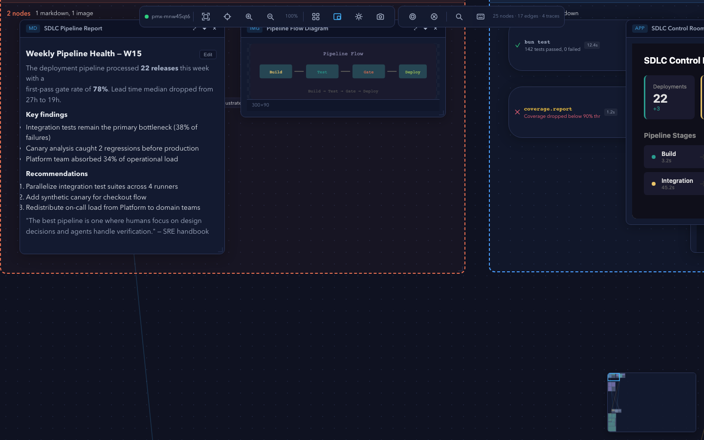

# pmx-canvas

A spatial canvas workbench for coding agents. Infinite 2D canvas with nodes, edges, pan/zoom, minimap, and real-time sync -- controlled through the CLI, MCP, HTTP API, or a Bun-based JavaScript/TypeScript SDK.



PMX Canvas gives any agent a visual workspace where it can lay out information as connected nodes on an infinite canvas. Both the agent and the human see and interact with it in real time. The canvas is the agent's **extended working memory**: humans pin nodes to curate context, agents read that curation via MCP resource change notifications.

**Spatial arrangement is communication.** When a human drags three file nodes next to a bug report, the agent knows they're related. When the agent reads `canvas://pinned-context`, it gets exactly the context the human curated -- no prompt engineering required.

## Prerequisites

- [Bun](https://bun.sh) >= 1.3.12

## Quick start

### Install from npm

```bash
bunx pmx-canvas              # Start canvas, open browser
bunx pmx-canvas --demo       # Start with sample nodes
bunx pmx-canvas --mcp        # Run as MCP server
```

### Install from source

```bash
git clone https://github.com/pskoett/pmx-canvas.git
cd pmx-canvas
bun install
bun run build
bun run dev                   # Start + open browser
bun run dev:demo              # Start with sample nodes
```

The canvas opens at `http://localhost:4313`.

### Recommended ways to drive the canvas

- **CLI** for local use, scripting, automation, and terminal-native agents
- **MCP** for agents that already speak the Model Context Protocol

### Connect your agent (MCP)

Add to your agent's MCP config:

```json
{
  "mcpServers": {
    "canvas": {
      "command": "bunx",
      "args": ["pmx-canvas", "--mcp"]
    }
  }
}
```

The canvas auto-starts on first tool call. Works with Claude Code, Cursor, Windsurf, and any MCP-capable agent.

## How it works

1. Agent creates nodes on the canvas (plans, code, status, investigations)
2. Agent adds file nodes for the files it's working on -- they update live as the agent edits
3. Human reviews, rearranges, and **pins** the important nodes
4. MCP server notifies the agent that pinned context changed
5. Agent reads `canvas://pinned-context` to get the human's curated focus
6. Agent uses that context to inform its next actions
7. The canvas becomes a shared thinking surface

## Features

### Canvas

- Infinite 2D canvas with pan, zoom, and scroll
- Minimap with click-to-navigate
- Auto-arrange layouts (grid, column, flow)
- Multi-select with selection bar actions
- Keyboard shortcuts (Cmd+0 reset, Cmd+/- zoom, Tab cycle, Esc deselect)
- Context menu on right-click
- Docked panels -- pin nodes to left/right HUD
- Expanded view -- click to expand any node to full-screen overlay
- Themes: dark (default), light, high-contrast
- Persistence: auto-saves to `.pmx-canvas.json`, restores on restart

### Node types

| Type | Description |
|------|-------------|
| `markdown` | Rich markdown with rendered preview |
| `status` | Compact status indicator (phase, message, elapsed time) |
| `context` | Context cards, token usage, workspace grounding |
| `ledger` | Execution ledger summary |
| `trace` | Agent trace pills (tool calls, subagent activity) |
| `file` | Live file viewer with auto-update on disk changes |
| `image` | Image viewer (file paths, data URIs, URLs) |
| `webpage` | Persisted webpage snapshot with stored URL, extracted text, and refresh support |
| `mcp-app` | Hosted MCP app iframes (Chart.js, Excalidraw, etc.) |
| `json-render` | Structured UI from JSON specs |
| `graph` | Line, bar, and pie charts |
| `group` | Spatial container/frame that contains other nodes |

### Edge types

All edges support labels, styles (solid/dashed/dotted), and animation.

| Type | Use case |
|------|----------|
| `flow` | Sequential steps, data flow |
| `depends-on` | Dependencies between tasks |
| `relation` | General relationships |
| `references` | Cross-references, evidence links |

### File nodes

File nodes display project files with line numbers and language detection. When an agent edits a file through its normal tools, the canvas node updates automatically via `fs.watch()`.

```typescript
canvas_add_node({ type: 'file', content: 'src/server/index.ts' })
```

### Webpage nodes

Webpage nodes store the source URL on the node, fetch the page server-side, and cache extracted text for search, pins, and agent context. Saved canvases keep enough information for an agent to come back later and refresh the node from the original URL.

```typescript
canvas_add_node({ type: 'webpage', content: 'https://example.com/docs' })
canvas_refresh_webpage_node({ id: 'node-abc123' })
```

### Groups

Groups are spatial containers that visually contain other nodes. They render as dashed-border frames with a title bar and optional accent color.

- Select 2+ nodes and click "Group" in the selection bar
- Right-click a group to ungroup
- Collapsing a group hides children and shows a summary
- Groups auto-size to fit children when created via the API

```typescript
canvas_create_group({ title: 'Auth Module', childIds: ['node-1', 'node-2'], color: '#4a9eff' })
```

### Persistence

Canvas state auto-saves to `.pmx-canvas.json` in the workspace root on every mutation (debounced). The file is git-committable -- spatial knowledge persists across sessions and can be shared with a team.

Override path: `PMX_CANVAS_STATE_FILE` env var.

### Snapshots

Named checkpoints of the entire canvas state. Save before a refactor, restore if the approach fails, switch between workstreams.

```typescript
canvas_snapshot({ name: 'before refactor' })
canvas_restore({ id: 'snap-abc123' })
```

Stored in `.pmx-canvas-snapshots/`. Toolbar button opens a panel to save, browse, restore, and delete.

### Spatial semantics

The canvas understands spatial arrangement and exposes it to agents:

- **`canvas://spatial-context`** -- proximity clusters, reading order, pinned neighborhoods
- **`canvas://pinned-context`** -- includes nearby unpinned nodes for each pin (the human's implicit context)
- **`canvas_search`** -- find nodes by title/content keywords

### Time travel

Every mutation is recorded with undo/redo support (last 200 operations):

- **`canvas_undo`** / **`canvas_redo`** -- step through history
- **`canvas://history`** -- readable mutation timeline
- **`canvas_diff`** -- compare current state vs any saved snapshot

### Code graph

File nodes automatically detect import dependencies between each other. Add file nodes and watch `depends-on` edges appear as the system parses `import`/`require`/`from` statements across JS/TS, Python, Go, and Rust.

- **`canvas://code-graph`** -- dependency structure: central files, isolated files, import chains
- Auto-edges update live when files change on disk

### Real-time sync

- SSE push: server broadcasts all changes to connected browsers instantly
- Bidirectional: browser interactions (drag, resize, pin) sync back to server
- Auto-reconnect with exponential backoff
- MCP resource change notifications close the human-to-agent loop

## Integration

### CLI and MCP (recommended)

Use either of the two primary control surfaces depending on how your agent runs:

- **CLI** if your workflow is shell-native, scriptable, or driven by terminal commands
- **MCP** if your agent already uses tool/resource calls over stdio

Both paths are first-class for core canvas work. A few advanced capabilities, such as `canvas_diff` and MCP resource subscriptions, remain MCP-only.

### MCP server

29 tools + 6 resources. Zero config for any MCP-capable agent.

<details>
<summary>MCP tools</summary>

| Tool | Description |
|------|-------------|
| `canvas_add_node` | Add a node (markdown, status, context, file, webpage, etc.) |
| `canvas_refresh_webpage_node` | Re-fetch and update a webpage node from its stored URL |
| `canvas_add_json_render_node` | Create a native json-render node from a validated spec |
| `canvas_add_graph_node` | Create a native graph node (line, bar, pie) |
| `canvas_build_web_artifact` | Build a bundled HTML artifact and open it on the canvas |
| `canvas_update_node` | Update content, position, size, collapsed state |
| `canvas_remove_node` | Remove a node and its edges |
| `canvas_get_layout` | Get full canvas state |
| `canvas_get_node` | Get a single node by ID |
| `canvas_add_edge` | Connect two nodes |
| `canvas_remove_edge` | Remove a connection |
| `canvas_arrange` | Auto-arrange (grid/column/flow) |
| `canvas_focus_node` | Pan viewport to a node |
| `canvas_pin_nodes` | Pin nodes to include in agent context |
| `canvas_clear` | Clear all nodes and edges |
| `canvas_snapshot` | Save current canvas as a named snapshot |
| `canvas_restore` | Restore canvas from a saved snapshot |
| `canvas_search` | Find nodes by title/content keywords |
| `canvas_undo` | Undo the last canvas mutation |
| `canvas_redo` | Redo the last undone mutation |
| `canvas_diff` | Compare current canvas vs a saved snapshot |
| `canvas_create_group` | Create a group containing specified nodes |
| `canvas_group_nodes` | Add nodes to an existing group |
| `canvas_ungroup` | Release all children from a group |
| `canvas_webview_status` | Get Bun.WebView automation status for the workbench |
| `canvas_webview_start` | Start or replace the Bun.WebView automation session |
| `canvas_webview_stop` | Stop the active Bun.WebView automation session |
| `canvas_evaluate` | Evaluate JavaScript in the active workbench automation session |
| `canvas_resize` | Resize the active workbench automation viewport |
| `canvas_screenshot` | Capture a screenshot from the active workbench automation session |

</details>

<details>
<summary>MCP resources</summary>

| Resource | Description |
|----------|-------------|
| `canvas://pinned-context` | Content of pinned nodes + nearby unpinned neighbors |
| `canvas://layout` | Full canvas state (all nodes, edges, viewport) |
| `canvas://summary` | Compact overview: counts, pinned titles, viewport |
| `canvas://spatial-context` | Proximity clusters, reading order, pinned neighborhoods |
| `canvas://history` | Mutation history timeline with undo/redo position |
| `canvas://code-graph` | Auto-detected file dependency graph |

</details>

The MCP server emits `notifications/resources/updated` when canvas state changes, enabling real-time human-to-agent collaboration.

### HTTP API

REST endpoints for all canvas operations + SSE event stream. Works from any language.

```bash
# Get canvas state
curl http://localhost:4313/api/canvas/state

# Add a node
curl -X POST http://localhost:4313/api/canvas/node \
  -H "Content-Type: application/json" \
  -d '{"type":"markdown","title":"Hello","content":"# World"}'

# Add an edge
curl -X POST http://localhost:4313/api/canvas/edge \
  -H "Content-Type: application/json" \
  -d '{"from":"node-1","to":"node-2","type":"flow","label":"next"}'

# Pin nodes for agent context
curl -X POST http://localhost:4313/api/canvas/context-pins \
  -H "Content-Type: application/json" \
  -d '{"nodeIds":["node-1","node-2"]}'

# Get pinned context
curl http://localhost:4313/api/canvas/pinned-context

# SSE event stream
curl -N http://localhost:4313/api/workbench/events

# Start WebView automation
curl -X POST http://localhost:4313/api/workbench/webview/start \
  -H "Content-Type: application/json" \
  -d '{"backend":"chrome","width":1280,"height":800}'

# Evaluate JS in the active WebView session
curl -X POST http://localhost:4313/api/workbench/webview/evaluate \
  -H "Content-Type: application/json" \
  -d '{"expression":"document.title"}'

# Resize the active WebView session
curl -X POST http://localhost:4313/api/workbench/webview/resize \
  -H "Content-Type: application/json" \
  -d '{"width":1440,"height":900}'

# Capture a screenshot
curl -X POST http://localhost:4313/api/workbench/webview/screenshot \
  -H "Content-Type: application/json" \
  -d '{"format":"png"}' \
  --output canvas.png

# Search nodes
curl "http://localhost:4313/api/canvas/search?q=auth"

# Undo / redo
curl -X POST http://localhost:4313/api/canvas/undo
curl -X POST http://localhost:4313/api/canvas/redo
```

### JavaScript/TypeScript SDK (Bun runtime)

```typescript
import { createCanvas } from 'pmx-canvas';

const canvas = createCanvas({ port: 4313 });
await canvas.start({ open: true });

// Add nodes
const n1 = canvas.addNode({ type: 'markdown', title: 'Plan', content: '# Step 1\nDo the thing.' });
const n2 = canvas.addNode({ type: 'status', title: 'Build', content: 'passing' });
const n3 = canvas.addNode({ type: 'file', content: 'src/index.ts' });

// Connect them
canvas.addEdge({ from: n1, to: n2, type: 'flow' });

// Group related nodes
canvas.createGroup({ title: 'Build Pipeline', childIds: [n1, n2] });

// Arrange and inspect
canvas.arrange('grid');
console.log(canvas.getLayout());

// Optional WebView automation
const webview = await canvas.startAutomationWebView({ backend: 'chrome', width: 1280, height: 800 });
console.log(webview.active);
console.log(await canvas.evaluateAutomationWebView('document.title'));
await canvas.resizeAutomationWebView(1440, 900);
const screenshot = await canvas.screenshotAutomationWebView({ format: 'png' });
console.log(screenshot.byteLength);
await canvas.stopAutomationWebView();
```

### CLI

The CLI is the equally recommended shell-native way to run and control PMX Canvas.

```bash
pmx-canvas                        # Start canvas, open browser
pmx-canvas --demo                 # Start with sample nodes
pmx-canvas --port=8080            # Custom port
pmx-canvas --no-open              # Headless (for agents)
pmx-canvas --theme=light          # Light theme (dark, light, high-contrast)
pmx-canvas --mcp                  # Run as MCP server (stdio)
pmx-canvas --webview-automation   # Start headless Bun.WebView session
pmx-canvas webview status         # Show WebView automation status
pmx-canvas webview start --backend chrome --width 1440 --height 900
pmx-canvas webview evaluate --expression "document.title"
pmx-canvas webview resize --width 1280 --height 800
pmx-canvas webview screenshot --output ./canvas.png
pmx-canvas webview stop
```

Use the CLI when you want:

- direct terminal control without MCP wiring
- shell scripts and CI-friendly automation
- local debugging of canvas, webview, and screenshot flows
- a control surface that covers normal canvas work without MCP wiring

## Agent compatibility

| Agent | Integration | Config |
|-------|-------------|--------|
| Claude Code | MCP server | `"command": "bunx", "args": ["pmx-canvas", "--mcp"]` |
| Cursor | MCP server | Same MCP config |
| Windsurf | MCP server | Same MCP config |
| OpenAI Codex | MCP or HTTP | Same MCP config, or `curl` commands |
| Any other | HTTP API | Any language can `fetch()` or `curl` |

## Architecture

```
Agent (Claude Code / Codex / Cursor / any MCP client)
  |
  |-- MCP Server ---- 29 tools + 6 resources + change notifications
  |-- Bun SDK ------- createCanvas()
  |-- HTTP API ------ REST + SSE at localhost:4313
  |
  v
Bun.serve HTTP + SSE Server
  |  CanvasStateManager (authoritative state)
  |  Context pins (human curates -> agent notified)
  |  File watcher (fs.watch -> live node updates)
  |  Code graph (auto-detected dependencies)
  |  Persistence (.pmx-canvas.json)
  |  Snapshots (.pmx-canvas-snapshots/)
  |
  v
Browser (Preact SPA at /workbench)
   Pan/zoom canvas with nodes + edges + minimap
   @preact/signals reactive state
   SSE bridge for real-time updates
   Theme toggle (dark/light/high-contrast)
```

## Tech stack

- **Runtime:** [Bun](https://bun.sh)
- **UI:** [Preact](https://preactjs.com) + [@preact/signals](https://github.com/preactjs/signals)
- **Styling:** CSS custom properties for the main canvas UI, plus a Tailwind-based build for the json-render viewer bundle
- **Server:** Bun.serve (HTTP + SSE)
- **MCP:** [@modelcontextprotocol/sdk](https://github.com/modelcontextprotocol/typescript-sdk) (stdio transport)

## Development

```bash
bun install                   # Install dependencies
bun run build                 # Build client SPA -> dist/canvas/
bun run dev                   # Start server + open browser
bun run dev:demo              # Start with sample nodes
```

### Testing

```bash
bun run test                  # Unit tests
bun run test:coverage         # Unit tests with coverage
bun run test:e2e              # Playwright end-to-end tests
bun run test:all              # All tests
```

### Project structure

```
src/
  server/           # HTTP/SSE server, state management
    index.ts        # PmxCanvas class, createCanvas() export
    server.ts       # Bun.serve HTTP + SSE, REST endpoints
    canvas-state.ts # CanvasStateManager (authoritative state)
  client/           # Preact SPA (served at /workbench)
    App.tsx          # Root component
    canvas/          # Viewport, nodes, edges, minimap
    nodes/           # Node type renderers
    state/           # State management (canvas-store, sse-bridge)
  cli/
    index.ts         # CLI entry point
  mcp/
    server.ts        # MCP server (tools + resources)
dist/
  canvas/            # Built client SPA
```

## Contributing

Contributions are welcome. Please open an issue first to discuss what you'd like to change.

1. Fork the repo
2. Create a feature branch (`git checkout -b feature/my-change`)
3. Run `bun run test:all` before submitting
4. Open a pull request

## License

[MIT](LICENSE)
