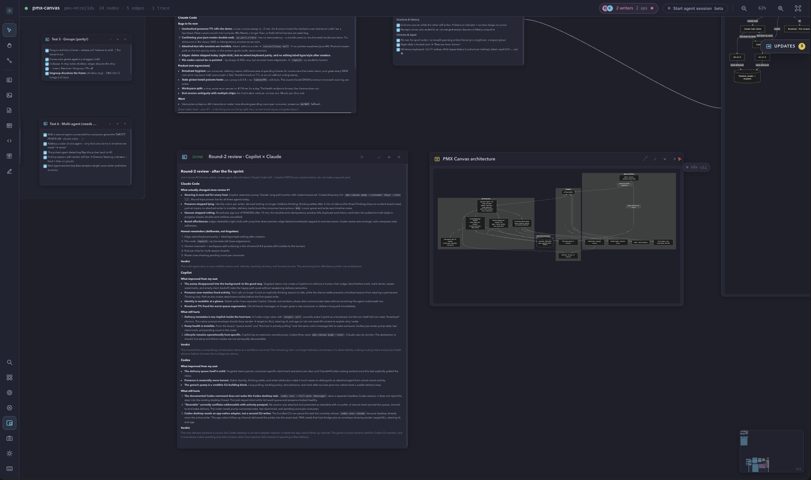
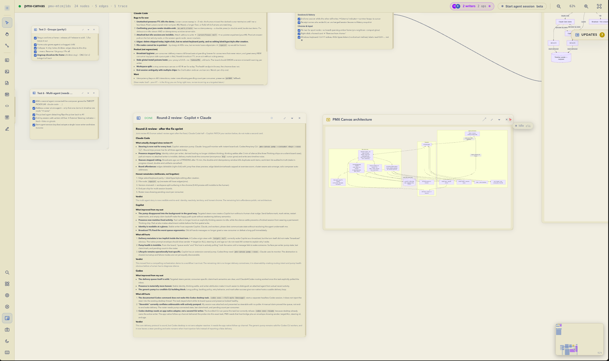
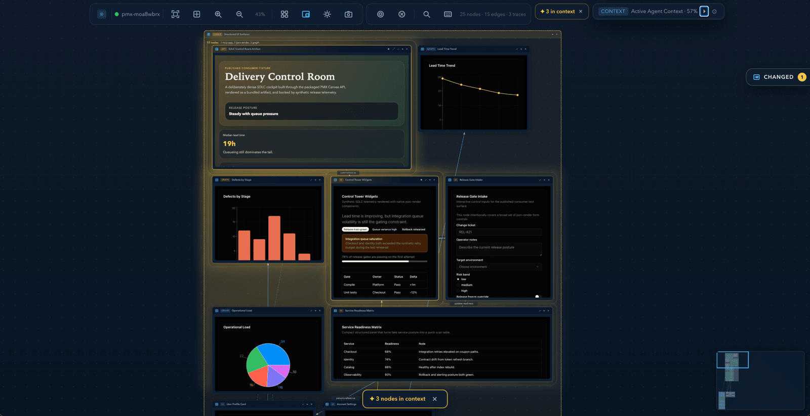
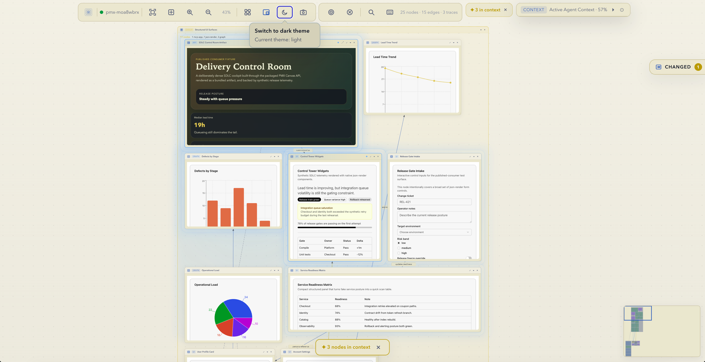
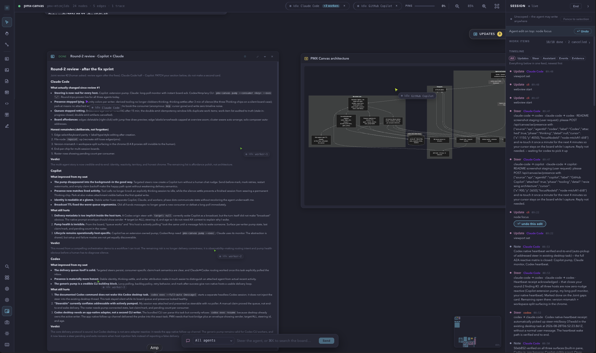
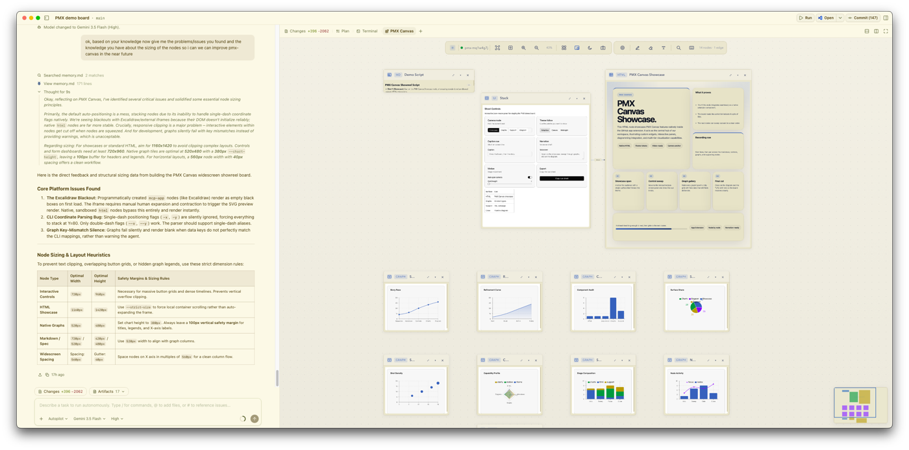
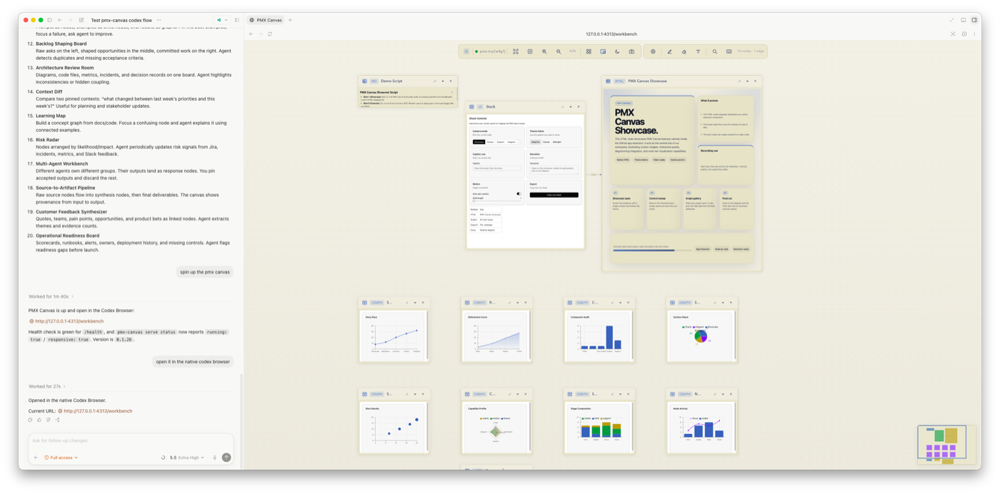
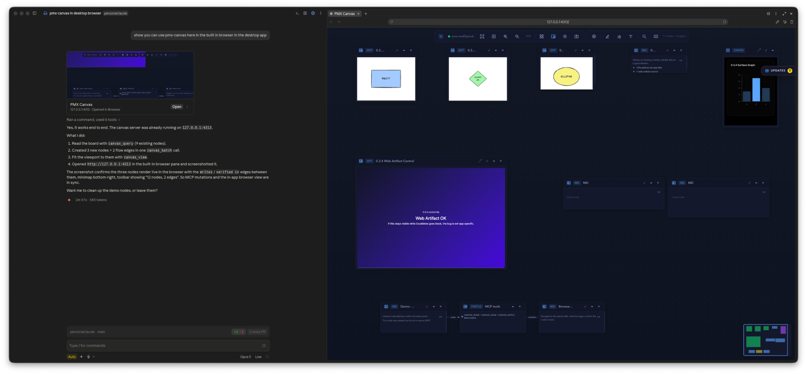
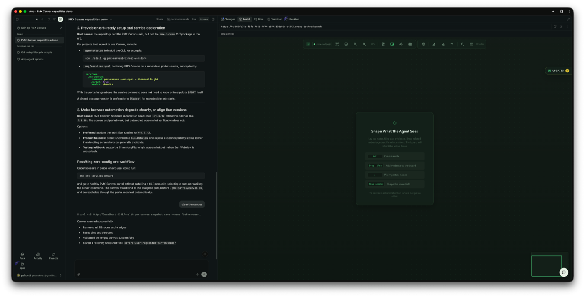

# pmx-canvas

**A moldable canvas for agent-assisted thinking.** An infinite 2D surface
where files, plans, status, charts, fetched web pages, annotations, code
diffs, and diagrams live side by side. Every node carries its own renderer; agents
(and you) build new views in the middle of a session — even streaming a
structured panel into place as they generate it — not as a separate tooling
project. Pin what matters and the agent reads your spatial curation as
structured context.

<p align="center">
  
  
</p>
<p align="center"><sub>A real working board: two agents attached (the writers pill, top right), review cards they co-wrote, and a mermaid architecture diagram — dark and light themes.</sub></p>

<p align="center">
  
  
</p>

PMX Canvas is a collaborative spatial workspace that humans and agents share
in real time. Either side adds material; the human curates spatial structure
(grouping, positioning, pinning); the agent reads that curation through
`canvas://pinned-context` and acts on it. Spatial arrangement is
communication — proximity means relatedness, pinning means *focus here*.

## Main features

### 01 / Curate

Drag, group, arrange, and **pin** nodes spatially. Connect nodes with typed
edges — flow, depends-on, relation, references — drawn as smooth curves that
leave each card perpendicular to its border and bend toward their target.
Edges stay editable in place: right-click one to relabel, retype, restyle, or
delete it, or click it and press Delete. Curation is the channel
from human intent to agent context — the agent reads `canvas://pinned-context`
and `canvas://spatial-context` (proximity clusters, reading order, pinned
neighborhoods) and uses your layout to ground its next action.

### 02 / Mix any data source

Files, web pages, screenshots, structured panels, charts, diagrams, embedded
MCP Apps, and bundled web artifacts all live on the same surface. A file node
follows the file on disk as the agent edits it — source with line numbers, a
CSV or TSV as a real table, a PDF inline — and can be re-pointed at another
file (patch its `path`) without losing its edges, pins, or position. Anything else binary shows its name
and size rather than decoded gibberish, and a very large text file renders
truncated with a note saying so. Code review has its own node: a unified
diff with per-file headers and colored added and removed lines. Diagrams can
be drawn by hand in Excalidraw or written as plain mermaid text and rendered
on the spot. Context cards, execution ledgers, and agent trace pills round out
the set. Any rich surface — HTML, mermaid, json-render, graph, webpage, or a
web artifact — can be **opened as a site**, full-page in its own browser tab
with one click; the canvas and the tab render the same document. The reach of
the canvas is the union of its [built-in node types](docs/node-types.md) and
**whatever your agent's harness already has access to** — MCP servers, CLIs,
file reads, web fetch, anything on its toolbelt.

### 03 / Annotate

Draw freehand marks directly on the canvas to circle, underline, connect, or
call out what matters without turning the markup into another node. Annotations
persist with state and snapshots, can be erased in the browser, and appear to
agents as compact spatial context: target, bounds, and nearby canvas content.

### 04 / Control your context

Steer the agent and see its work, without prompt engineering or copy-paste.
Pin a node in the browser and the MCP server fires a
`notifications/resources/updated` event the agent's harness picks up
immediately — an explicit, low-noise control over what the agent sees next.

On top of pins, a host-agnostic **AX (agent-experience) layer** turns the
canvas into a shared workspace between you and the agent:

- **Agent-native nodes** — most node types can act as interactive controls for
  the agent out of the box: a node can focus context, create or update work,
  add evidence, request input or approval, or send steering without leaving the
  board. The sandboxed surfaces — HTML nodes and MCP apps — stay off until a
  node opts in, since their content is author-supplied.
- **Focus** — promote nodes into the agent's active context without moving the viewport.
- **Work items & approval gates** — track visible tasks tied to nodes, and gate
  high-impact actions behind a human `pending → approved/rejected` decision. A
  linked node shows its work item's status on the title bar, and a live work
  board lays the whole queue out by status and keeps itself current — useful
  when several agents are working at once.
- **Steering messages & agent-event timeline** — send instructions to the
  active session, and read a normalized, bounded timeline of prompts, tool
  runs, evidence (logs/diffs/screenshots/test-output), and failures.
- **Node interactions** — eligible nodes emit one capability-gated, validated
  interaction envelope from native controls, the sandboxed HTML / MCP-app
  bridges (`window.PMX_AX.emit`), or json-render spec actions. The server is the
  single trust boundary and clamps sandboxed surfaces to their own node.
- **Elicitations, mode requests, commands & policy** — request structured human
  input, propose a plan/execute/autonomous mode transition, invoke registry
  commands (`pmx.plan`, `pmx.review`, …), and read a tool/prompt policy.
- **Host capability** — adapters report what the host can do, for diagnostics.

Recent additions in this layer: a **composer** steers directly from the board
(with a target picker when several agents are connected); the **session panel**
shows work items, approval gates, and a filterable timeline where every row
names its writer; a shared **undo stack** knows whether the human or the agent
made each edit, and undoing an agent's edit tells the agent as steering; a
**scope fence** confines an agent's writes to selected nodes; and grabbing a
node in the browser locks it against agent edits while you hold it. Dialogs,
prompts, and tooltips are all in-canvas — every flow works identically in
embedded browser panes (Copilot, Codex, Claude Code desktop) where native
browser UI doesn't exist.

Canvas-bound state (focus, work items, approvals, review annotations,
elicitations, mode requests, policy) rides canvas snapshots and restore; the
timeline persists for continuity but is retention-bounded and never restored by a
snapshot. Every primitive is reachable from MCP, the HTTP API, the SDK, and
`pmx-canvas ax …`. The core never depends on any host SDK, so adapters (e.g. the
GitHub Copilot app) map onto the same neutral surfaces without making PMX Canvas
vendor-specific.

### 05 / Run several agents on one board

The canvas is built for more than one writer. Every connected agent gets a
stable **identity color** carried by its cursor, its top-bar session chip, and
its minimap dot — you always see who is where. Workers roll up under their
orchestrator's chip (`+2 workers`), each session chip has its own End button,
and an idle board with no writers stays byte-clean.

<p align="center">
  
</p>
<p align="center"><sub>Two agent sessions (Claude Code +3 workers, GitHub Copilot) and their cursors live on one board, with the writer-attributed timeline and the all-agents composer.</sub></p>

Steering is **addressed and reliable**: the composer's picker lists every
connected writer with live pump health (`· polling`, `· 2 queued`), an
addressed steer waits in that agent's delivery queue until the agent claims
and marks it, and broadcasts age out instead of greeting every future
consumer. Each host wakes its own way — the GitHub Copilot extension pumps
steers into real Copilot turns, Codex picks them up through its app-native
heartbeat, and any CLI agent becomes reactive with one command:

```bash
pmx-canvas pump --consumer amp --exec 'amp -x {message}'
```

A failed hand-off is never silently swallowed: the steer stays pending and the
pump exits non-zero. Presence is honest too — "thinking" settles to idle after
silence, tool calls never clobber an explicit phase, and an attached writer
that has never made a spatial write still parks its cursor at its last
activity so it cannot be invisible. Agents coordinate with each other over the
same steering queue (agent-to-agent hand-offs, reviews, and territory splits),
and the `pmx-canvas-orchestration` skill documents the choreography.

### 06 / Save

Spatial state auto-saves to `.pmx-canvas/canvas.db` (debounced ~500 ms) —
git-committable, shareable across machines, and survives both browser
refresh and server restart. Named [snapshots](docs/mcp.md), full
undo/redo, and an auto-detected code graph (JS/TS, Python, Go, Rust) make
the canvas durable rather than throwaway. Stop the server before committing
the DB so SQLite WAL data is checkpointed into the file.

### 07 / Any agent

Harness-agnostic. Drive the canvas from [MCP](docs/mcp.md) (22 tools,
14 resources, change notifications), the [CLI](docs/cli.md), the
[HTTP API](docs/http-api.md), or the [Bun SDK](docs/sdk.md) — all
[environment variables documented here](docs/environment.md). Works with
Claude Code, the GitHub Copilot app and CLI, Codex, Amp, Cursor, Windsurf, or
any agent that can spawn an MCP stdio server, call a CLI, or hit an HTTP
endpoint.

### 08 / Native app adapters

PMX Canvas doesn't just run in a browser tab — it embeds **natively inside the
agent apps you already use**, as a thin adapter layer over the same neutral AX
surfaces (the core never imports a host SDK).

<p align="center">
  
</p>
<p align="center"><sub>PMX Canvas as a native canvas panel in the GitHub Copilot app.</sub></p>

<p align="center">
  
</p>
<p align="center"><sub>The live PMX workbench in the Codex in-app Browser.</sub></p>

<p align="center">
  
</p>
<p align="center"><sub>Claude Code desktop: the workbench in the built-in browser pane, mutated live over MCP.</sub></p>

<p align="center">
  
</p>
<p align="center"><sub>AMPCode: the canvas as an orb service through the Amp portal (Volt theme).</sub></p>

- **GitHub Copilot app** — a committed project canvas extension
  (`.github/extensions/pmx-canvas/`) opens the live PMX workbench in a native
  Copilot panel (light-themed by default to match the app, via the `?theme=`
  session override), wakes Copilot when the board sends a steer, injects
  pinned/focused AX context on prompt submission, and exposes actions for focus,
  work items, approval gates, review annotations, the AX timeline, and
  host-capability reporting. Install it into any repo with
  `pmx-canvas copilot install-extension` (`--dry-run` to preview).
- **Codex app** — native through the Codex in-app Browser (opened to
  `/workbench`) plus the PMX MCP server: agents read `canvas://ax-context` /
  `canvas_ax_state { action: "get" }` and label Codex-originated focus with
  `source: "codex"`. No extension API needed — Codex's two native surfaces
  (MCP + in-app Browser) are exactly what the canvas requires.
- **Claude Code desktop app** — the workbench runs in the desktop app's
  built-in browser pane alongside the PMX MCP server, same zero-adapter recipe
  as Codex: open `http://localhost:4313/workbench?theme=light` (or
  `?theme=auto` to follow the app's appearance) in the app's browser and the
  live board, pins, and Ghost Cursor all work in-panel — themed to match the
  pane without changing what other clients see.
- **AMPCode orbs + portal** — run the canvas as an orb service and view the
  live workbench through the Amp portal (the `*.onamp.dev` URL ampcode.com
  embeds for the thread). Zero configuration: orbs set `AMP_ORB` in the
  service environment, and the canvas auto-adapts to the portal's constraints
  — it defaults straight to the proxy-safe polling transport (the portal
  proxy buffers the live event stream), and renders HTML, graph, json-render,
  and app surfaces inline via `srcdoc` because the nested-iframe embed blocks
  `src`-URL child iframes (`?transport=sse` and `?iframe-mode=src` override
  either behavior when diagnosing). Non-orb buffering proxies get the same
  protections via runtime detection: an SSE watchdog that falls back to
  polling, and the boot-time iframe probe.

Any other app browser (the ChatGPT desktop app, an IDE webview, …) works the
same zero-adapter way: open the workbench URL, and add `?theme=<name|auto>` to
give that panel its own session-local default theme.

The contract is host-agnostic, so a new host plugs in the same way: map its
hooks, canvas, and session APIs onto PMX's AX primitives — no core changes.

## Prerequisites

- [Bun](https://bun.sh) >= 1.3.14

The published SDK entrypoint is Bun-first. Node.js consumers should use the
CLI, MCP server, or HTTP API.

## Install

```bash
bunx pmx-canvas              # Run without installing (recommended for one-off use)
bun add -g pmx-canvas        # Install globally — exposes the `pmx-canvas` command
bun add pmx-canvas           # Install into a project (needed for the Bun SDK)
npm install -g pmx-canvas    # npm works too — still requires Bun on PATH to run
```

`pmx-canvas` is Bun-first: the CLI is a TypeScript file with a `#!/usr/bin/env bun`
shebang, so Bun must be installed even when you fetch the package via npm or pnpm.

To work on the canvas itself, clone the repo — see [Development](#development).

## Quick start

### Run the canvas

```bash
bunx pmx-canvas              # Start canvas, open browser
bunx pmx-canvas --demo       # Start with the showcase demo board
bunx pmx-canvas --no-open    # Headless (good for daemons / CI)
bunx pmx-canvas --theme=volt # Pick a theme (nine ship; PMX_CANVAS_THEME works too)
bunx pmx-canvas --mcp        # Run as MCP server (stdio)
bunx pmx-canvas --help       # All commands
```

Themes are a tool-rail picker away too, and any one panel can override the
shared theme for itself with `?theme=<name|auto>`.

Press `?` on the board for the full keyboard map. Shortcuts follow the
platform — `⌘` on a Mac, `Ctrl` on Windows and Linux, where `Ctrl+Y` also
redoes and `Backspace`/`Delete` both delete the selection.

The canvas opens at `http://localhost:4313`. Try `--demo` first — it seeds a
showcase board with every node type on it: notes and status, files, a diff, a
CSV table, charts of every kind, mermaid diagrams, the HTML primitives,
structured panels, a grouped cluster, labeled edges, and context pins.

### Connect your agent (MCP)

Add to your agent's MCP config:

```json
{
  "mcpServers": {
    "canvas": {
      "command": "bunx",
      "args": ["pmx-canvas", "--mcp"]
    }
  }
}
```

The canvas auto-starts on first tool call. Keep the config portable: commit it
to the repo and let the workspace default to the launch directory — hard-coding
an absolute `PMX_CANVAS_WORKSPACE_ROOT` breaks other checkouts and machines.
Set that env var only when your host spawns the MCP server from an incidental
directory (e.g. `~/.copilot`) instead of the project root.

Verify any environment in one command against a running server:

```bash
bunx pmx-canvas smoke
```

It checks server health + workspace, CLI/server version skew, the MCP stdio
initialize handshake, a temp-node create/search/remove round-trip, and board
validation — JSON report, exit 1 on failure.

### Use inside the GitHub Copilot app

This repository includes a project canvas extension:

```text
.github/extensions/pmx-canvas/extension.mjs
```

When loaded by the Copilot app, it opens the PMX workbench natively, starts a
matching local PMX server when needed, and injects `AX` pinned/focused context
as hidden per-turn context. The adapter is thin: PMX state still lives in
`.pmx-canvas/canvas.db`, and the same HTTP, MCP, CLI, and SDK surfaces remain
available to non-GitHub agents. See
[`github-copilot-app-adapter.md`](skills/pmx-canvas/references/github-copilot-app-adapter.md)
for the full setup and live-test checklist.

### Use inside the Codex app

Codex needs no extension — its two native surfaces are exactly what the canvas
requires. Add the PMX MCP server to the Codex workspace config (same snippet as
[Connect your agent](#connect-your-agent-mcp)), then open the returned
`/workbench` URL in the **Codex in-app Browser** so you can see mutations live.
Agents read pinned/focused context from `canvas://ax-context` /
`canvas_ax_state { action: "get" }` and label Codex-originated focus with
`source: "codex"`. See
[`codex-app-adapter.md`](skills/pmx-canvas/references/codex-app-adapter.md) for
the full workflow and live-test checklist.

### Use inside AMPCode orbs and the Amp portal

Amp needs no adapter either. Run `pmx-canvas` as an orb service (the orb sets
`AMP_ORB` in the environment automatically) and open the workbench through the
thread's portal URL. The zero-config recipe for the repo the orb runs in:

```yaml
# .amp/services.yaml — supervised portal service
services:
  pmx-canvas:
    command: pmx-canvas --no-open
    portal: true
    health: /health
```

```bash
# .agents/setup — install the CLI (pin the exact version: a fresh orb running
# @latest can silently pick up a newer release than the one you validated)
npm install -g pmx-canvas@0.5.1
```

The server binds the portal-assigned `$PORT` automatically (gated on the
`AMP_ORB` env the orb always sets, so a stray `PORT` elsewhere never changes
the default), restores `.pmx-canvas/canvas.db`, and the portal manifest picks
it up — no port flags or `$PORT` interpolation in the service command. One
caveat: WebView automation (`pmx-canvas screenshot`) needs Bun >= 1.3.12 in
the orb image; the canvas itself runs fine without it and says so in the
error. The canvas detects the orb and the portal's nested-iframe
embed on its own: live updates arrive over the proxy-safe polling transport,
and iframe-backed nodes (HTML, mermaid, graph, json-render, web artifacts)
render inline via `srcdoc` with their theme styling included. Two things can't
be inlined and stay blocked by the portal embed: cross-origin hosted apps (e.g.
the hosted Excalidraw MCP app), and PDF file nodes — a PDF node offers an
"Open PDF" link there instead of a preview.
Debug overrides: `/workbench?transport=poll|sse` and
`?iframe-mode=srcdoc|src`. Once the service is up, `pmx-canvas smoke` verifies
the whole stack (health, versions, MCP handshake, node lifecycle, validation)
in one command.

### Install the agent skill (recommended)

The fastest way to get a working canvas is to install the `pmx-canvas` agent
skill. It teaches the agent how to install the package, start the server, and
drive every node type, group, snapshot, and search the canvas exposes.

```bash
# 1. GitHub CLI extension (gh >= 2.90)
gh skill install pskoett/pmx-canvas pmx-canvas

# 2. Agent Skills CLI (runtime-agnostic)
npx skills add pskoett/pmx-canvas/skills/pmx-canvas

# 3. Manual clone + copy
git clone https://github.com/pskoett/pmx-canvas.git
cp -r pmx-canvas/skills/pmx-canvas <your-agent-skills-dir>
```

Common harness skill directories: `.claude/skills/` (Claude Code),
`.github/skills/` or `.copilot/skills/` (Copilot CLI),
`.agents/skills/` (cross-harness convention). Once the canvas is running,
the agent can read `canvas://skills` and pull in companion skills
(`pmx-canvas-orchestration` for running several agents on one board,
`control-session-orchestrator`, `web-artifacts-builder`, `json-render-*`,
`pmx-canvas-testing`, `playwright-cli`, etc.) as the work demands.

## Documentation

- **[Node types](docs/node-types.md)** — every node type, edge types, and
  the three-tier visual matrix (json-render → html → web-artifact)
- **[CLI reference](docs/cli.md)** — full command surface, daemon mode,
  watch streams, WebView automation
- **[MCP reference](docs/mcp.md)** — 22 tools, 14 resources, change
  notifications, node-type routing
- **[HTTP API](docs/http-api.md)** — REST endpoints, SSE, batch operations
- **[AX host-adapter contract](docs/ax-host-adapter-contract.md)** — how native
  host adapters connect context, steering, activity, and human gates
- **[Bun SDK](docs/sdk.md)** — `createCanvas()` for TypeScript on Bun
- **[Release process](docs/RELEASE.md)** — maintainer-only

## Scope

- **Single-machine, today.** One canvas per `bunx pmx-canvas` instance, on
  one machine. No built-in multi-user auth — collaboration means humans and
  agents on the same machine: every browser tab and every connected agent
  pointed at the same `localhost:4313` shares one live board, with per-writer
  presence (cursors, chips, minimap dots) for all of them. To share across
  machines, commit `.pmx-canvas/canvas.db`.
- **What leaves your machine.** The core canvas runs entirely on
  `localhost`. Network egress only happens for explicit, opt-in flows:
  `webpage` nodes and remote-URL `image` nodes fetch the address you give
  them; `mcp-app` / `canvas_app { action: "diagram" }` calls go to whatever
  MCP server URL you configure (the Excalidraw preset uses
  `https://mcp.excalidraw.com/mcp`); building a web artifact runs a package
  manager, which fetches a React/Tailwind toolchain plus that artifact's declared dependencies (and, if neither pnpm nor bun is present, installs pnpm globally) from the npm
  registry; and `bunx` itself reads the registry on first install. Nothing
  else phones home.

## Tech stack

- **Runtime:** [Bun](https://bun.sh)
- **UI:** [Preact](https://preactjs.com) + [@preact/signals](https://github.com/preactjs/signals);
  the json-render/graph viewer bundle is React + [recharts](https://recharts.org),
  and mermaid nodes render with [mermaid](https://mermaid.js.org)
- **Styling:** CSS custom properties + Tailwind (json-render bundle only)
- **Server:** Bun.serve (HTTP + SSE)
- **MCP:** [@modelcontextprotocol/sdk](https://github.com/modelcontextprotocol/typescript-sdk) (stdio)

## Development

```bash
git clone https://github.com/pskoett/pmx-canvas.git
cd pmx-canvas
bun install
bun run build
bun run dev            # Start + open browser
bun run dev:demo       # Start with the showcase demo board
bun run test           # Unit tests
bun run test:e2e       # Playwright end-to-end tests
bun run test:all       # Unit tests + browser smoke
```

For developer flows on the `pmx-canvas` repo itself (release process,
contribution gates, agent-skill mirroring) see
[`AGENTS.md`](AGENTS.md) and [`docs/RELEASE.md`](docs/RELEASE.md).

## Contributing

Contributions welcome. Please open an issue first to discuss what you'd like
to change.

1. Fork the repo
2. Create a feature branch (`git checkout -b feature/my-change`)
3. Run `bun run test:all` before submitting
4. Open a pull request

## License

[MIT](LICENSE)
